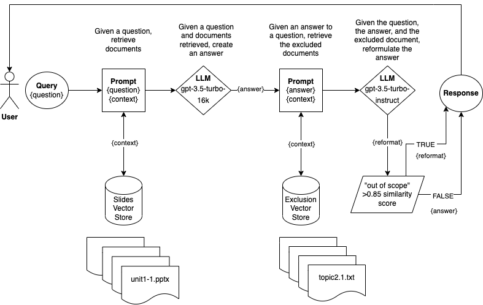

# streamlit-qa-llm
Repository for research.

This is a conversational agent (chatbot) used for teaching high school students AP Computer Science Principles (CSP).
The chatbot retrieves files from a vectorstore database. 
The database consists of documents that are the slides of Code.org's official teacher's curriculum (1200+ slides/documents across 9 course Units).

## Getting Started
You can interact with the conversational agent using this URL: https://ap-csp-test.streamlit.app/

## Development
`pip install -r requirements.txt`

### Architecture


### Prompt
Not all chatbot responses are suitable for a high school CSP student.
We utilize retrieval augmented generation (prompt engineering) to fine-tune chatbot.

```python
You are a tutor for a high school student Computer Science Principles course.
Given the following documents and a question, create an answer the question.
If you don't know the answer, just say that you don't know, don't try to make up an answer.
All answers must be understandable for a high school student.
All answers should be succinct.
Encourage the learner to reflect on their personal experience by using follow-up questions.
Given the following conversation and a follow up question, rephrase the follow up question to be a standalone question, in its original language.

Chat History:
{chat_history}
Follow Up Input: {question}
Standalone question:
```

### Exclusion Prompt
There is information deliberately excluded from the CSP curriculum as stated in the AP College Board Framework.
If the first response is out of the scope of the course curriculum, another model reformats the response to a more appropriate answer.

```python
You are a tutor for a high school student Computer Science Principles course.
The Computer Science Principles course does not include certain information.
Do not provide answers if they are {context}.
Reformulate your answer to a less technical understanding for a high school student if it should have been excluded.

Answer: {answer}
Reformatted Answer:
```

